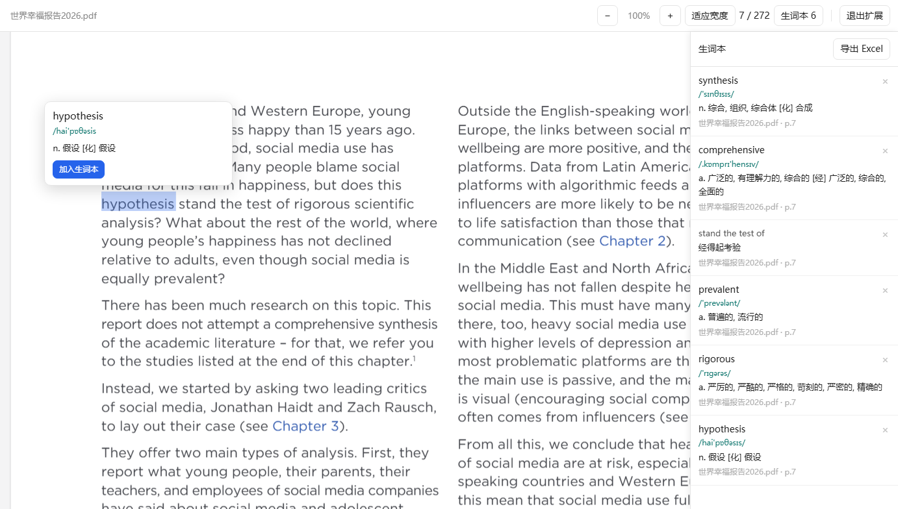

# 英文PDF阅读器

Chrome 扩展，支持在英文 PDF 上划词查词、划句翻译，记录生词。

读英文 PDF 时，查词、翻译、记录常常分散在三个程序中，需要反复切换窗口并手动复制粘贴，且无法溯回出处。  
本扩展将取词、翻译、收录合并进 PDF 阅读界面，无需切换程序，并自动记录每个生词来源，详细至文件名、页码。

## 功能

- **划词查词** —— 选中单词即显示音标与中文释义，内置 59111 条离线词库。自动识别单词变形，存入原词。
- **划句翻译** —— 选中整句或短语即显示中文译文，可与原文一并收录。
- **生词本** —— 单词与句子均可收录，并可导出 Excel（.xlsx）文件

## 安装

1. 下载本仓库(Code → Download ZIP，或 `git clone`)
2. Chrome 右上角三个点 → 「拓展程序」→「管理拓展程序」，或地址栏输入 `chrome://extensions`
3. **打开右上角「开发者模式」**
4. 点击左上角「加载已解压的扩展程序」，拖入本文件夹

## 使用

| 操作 | 结果 |
|---|---|
| 划选单词 | 显示音标与释义，可加入生词本 |
| 划选句子或短语 | 显示译文，可加入生词本 |
| 点击「生词本」 | 打开侧栏查看与删除 |
| 点击「导出 Excel」 | 导出全部生词到 .xlsx 表格 |
| 点击「适应宽度」 | 恢复自动缩放 |
| 点击「退出扩展」 | 当前文件改用 Chrome 自带的 PDF 查看器打开 |

## 注意事项

- 需要 Chrome 151 或更高版本。本扩展使用 Chrome 官方的 `chrome.mimeHandler` 接口，尚不支持 Edge 。
- **请勿移动或重命名扩展文件夹。** 开发者模式下扩展的标识由文件夹路径决定，路径变更后扩展仍可运行，但无法读取此前保存的生词。
- 查词使用离线词库，不联网。整句翻译调用在线接口，存在每日额度限制。

## 数据存储

生词保存在 `chrome.storage.local`，写入本机磁盘。关闭浏览器、重启电脑、清除浏览数据均不会丢失。

卸载扩展或删除扩展文件夹会一并清除数据，建议定期导出 Excel 备份。

数据仅存于本机，不进行跨设备同步。

## 实现方式

浏览器内置的 PDF 查看器运行在受保护环境中，扩展无法向其注入脚本。因此本扩展接管 PDF 的显示:通过 `mime_types_handler` 声明处理 `application/pdf`，由 Chrome 将 PDF 交由扩展页面渲染，浏览器地址栏仍保留原始 PDF 路径。

页面使用 PDF.js 渲染，画布分辨率取 `devicePixelRatio`，以适配高分屏。

导出 Excel 由扩展自行拼装 .xlsx（OOXML 包）文件，不依赖第三方表格库，离线可用。

## 文件说明

| 文件 | 说明 |
|---|---|
| `manifest.json` | 扩展清单 |
| `viewer.html` / `viewer.css` / `viewer.js` | 阅读器界面与逻辑 |
| `pdf.min.js` / `pdf.worker.min.js` | PDF.js 3.11.174 |
| `dict.js` | 离线英汉词库，59111 条 |

`dict.js` 由 ECDICT 完整词库(约 77 万条)裁剪生成:保留有词频记录的词条，以及带柯林斯星级、牛津 3000 或考试标签的词条，释义截断至 110 字符。

## 依赖与许可

- PDF.js —— Apache-2.0
- ECDICT —— MIT

---

> 作者：北斗惜风  
> 时间：2026/10
